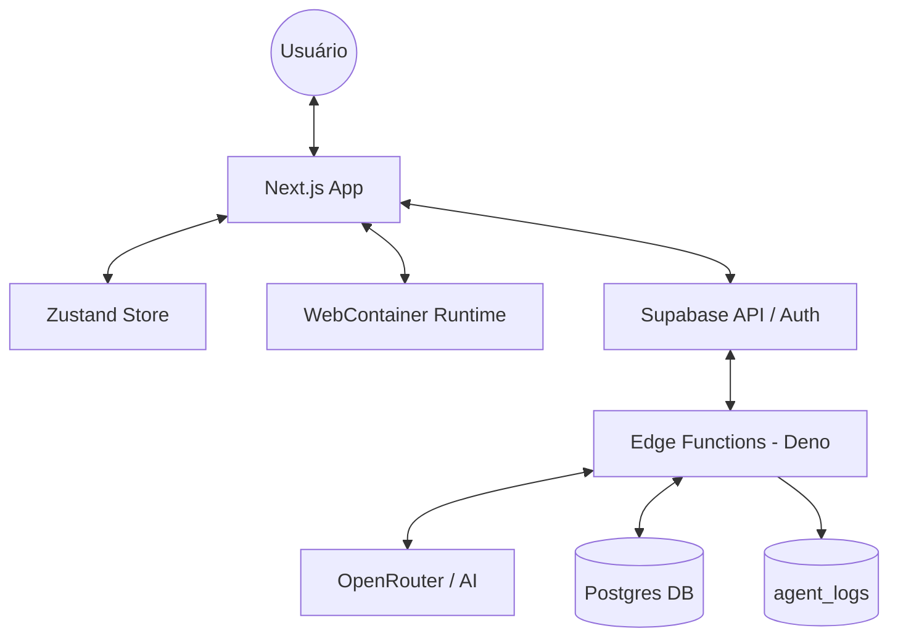
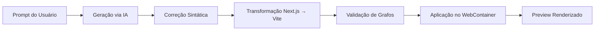

# Documentação do Sistema: AI App Builder (`app-builder`)

## Sumário

1. [Visão Geral e Objetivos](#1-visão-geral-e-objetivos)
2. [Arquitetura de Alto Nível (Macro)](#2-arquitetura-de-alto-nível-macro)
3. [Arquitetura de Pastas (Frontend & Backend)](#3-arquitetura-de-pastas-frontend--backend)
4. [Modelagem de Dados e Persistência](#4-modelagem-de-dados-e-persistência)
5. [Segurança e Row Level Security (RLS)](#5-segurança-e-row-level-security-rls)
6. [Pipeline de Geração e Resiliência de Código](#6-pipeline-de-geração-e-resiliência-de-código)
7. [Camada de Validação (Syntax Fixer & Import Validator)](#7-camada-de-validação-syntax-fixer--import-validator)
8. [Transformação Next.js → Vite (WebContainer)](#8-transformação-nextjs--vite-webcontainer)
9. [Runtime no Browser (WebContainer)](#9-runtime-no-browser-webcontainer)
10. [Gestão de Estado e Sincronização (Zustand)](#10-gestão-de-estado-e-sincronização-zustand)
11. [Integrações de IA e Streaming (SSE)](#11-integrações-de-ia-e-streaming-sse)
12. [Edge Functions (Backend Serverless)](#12-edge-functions-backend-serverless)
13. [Sistema de Logging (Agent Logs)](#13-sistema-de-logging-agent-logs)
14. [Observabilidade e Debugging](#14-observabilidade-e-debugging)
15. [Bibliotecas Disponíveis no WebContainer](#15-bibliotecas-disponíveis-no-webcontainer)
16. [Limitações e Pontos de Atenção](#16-limitações-e-pontos-de-atenção)
17. [Troubleshooting Avançado](#17-troubleshooting-avançado)
18. [Taxonomia de Erros (Debug Rápido)](#18-taxonomia-de-erros-debug-rápido)

---

## 1. Visão Geral e Objetivos

O **AI App Builder** é uma plataforma de desenvolvimento "low-code guiada por
IA" que permite a criação de aplicações web complexas sem necessidade de setup
local.

- **Ambiente de Desenvolvimento**: IDE web total com editor Monaco, terminal e
  gerenciador de arquivos.
- **Runtime**: Execução de Node.js via **WebContainers** da StackBlitz.
- **Cérebro**: Pipeline de IA que gera código baseado em prompts, imagens ou
  PRDs.
- **Persistência**: Backend serverless baseado no ecossistema Supabase.
- **Modelos de IA**: 
  - Geração principal: `google/gemini-3-flash-preview` (via OpenRouter)
  - Correção de código: `z-ai/glm-4.6` (baixa latência)

---

## 2. Arquitetura de Alto Nível (Macro)



### Componentes Chave:

- **Camada de Orquestração (Frontend)**: Next.js gerencia a UI e a sincronização
  entre o que a IA gera e o que o runtime executa.
- **Camada de Backend (Supabase)**: Trata autenticação, segurança (RLS) e
  processos pesados (IA) via Edge Functions de baixa latência em Deno.
- **Camada de Execução (WebContainer)**: Um micro-sistema operacional rodando em
  Web Workers, isolando o código do usuário do sistema principal.
- **Sistema de Logging**: Todas as Edge Functions registram execuções na tabela
  `agent_logs` para rastreamento e debugging.

---

## 3. Arquitetura de Pastas (Frontend & Backend)

### 3.1. Frontend (`/src`)

Estrutura modular focada em separação de preocupações:

```text
src/
├── app/                        # Camada de Roteamento (Next.js App Router)
│   ├── projects/[id]/          # Workspace Principal (IDE)
│   └── api/chat/               # Proxy para chats em modo demo/local
├── components/                 # Componentes de UI e Lógica de View
│   ├── chat/                   # Painel de IA, Streaming e Extração de código
│   │   ├── chat-panel.tsx      # Gerenciador de chat com streaming SSE
│   │   ├── message-bubble.tsx  # Renderização de mensagens
│   │   └── file-change-preview.tsx  # Preview de mudanças em arquivos
│   ├── ide/                    # Editor, File Explorer, Terminal
│   └── preview/                # Iframe e controle de ciclo de vida do WebContainer
├── hooks/                      # Hooks de infraestrutura
│   ├── use-webcontainer.ts     # 📦 ATUALIZADO: Gerenciamento completo do WebContainer
│   └── useCodeFixer.ts         # Hook para diagnóstico e correção de erros
├── lib/                        # Motores do sistema (Business Logic)
│   ├── code-validation/        # 📦 Camada de Resiliência
│   │   ├── syntax-fixer.ts     # Corretor heurístico de sintaxe JSX/HTML
│   │   └── validate-imports.ts # Analisador de grafos e geração de Stubs
│   ├── api/                    # Serviços de comunicação Supabase
│   │   └── project-service.ts  # Métodos para chat, save, fix-code
│   ├── debug/                  # 📦 NOVO: Sistema de logging
│   │   └── logger.ts           # Logs estruturados para WebContainer
│   └── webcontainer/           # Configurações de boot, packages e merges
│       ├── webcontainer.ts     # Funções core do WebContainer
│       └── use-webcontainer.ts # Hook com transformação Next.js → Vite
└── stores/
    └── ide-store.ts            # Estado reativo global (Zustand)
```

### 3.2. Backend (`/supabase`)

Arquitetura baseada em eventos e funções atômicas:

```text
supabase/
├── functions/                  # Edge Functions (Backend as a Service)
│   ├── _shared/                # 📦 NOVO: Código compartilhado
│   │   └── agent-logger.ts     # Helper de logging para agent_logs
│   ├── chat-stream/            # Streamer SSE principal com IA (Gemini 3 Flash)
│   ├── fix-code/               # 📦 NOVO: Corretor de código via IA (GLM 4.6)
│   ├── save-file/              # Persistência versionada de arquivos
│   ├── generate-prd/           # Gerador de Product Requirements Document
│   └── analyze-image/          # Pipeline de visão computacional
├── migrations/                 # Schema Evolutivo e Políticas RLS
│   ├── 20241219000000_core.sql      # Tabelas principais (orgs, projects)
│   ├── 20241219000001_files.sql     # Arquivos e versionamento
│   ├── 20241219000002_chat_ai.sql   # Mensagens e threads
│   ├── 20241219000003_infra.sql     # Infraestrutura auxiliar
│   ├── 20241219000004_policies.sql  # RLS policies
│   └── 20241220_create_agent_logs.sql  # 📦 NOVO: Logs de agentes
└── config.toml                 # Configuração do Supabase CLI
```

---

## 4. Modelagem de Dados e Persistência

### 4.1. Esquema Relacional

| Tabela | Descrição |
|--------|-----------|
| `orgs` & `org_members` | Gerencia isolamento multi-tenant |
| `projects` | Configurações do workspace do usuário |
| `project_files` | O "FileSystem" remoto. Armazena `path` e `content_text` |
| `chat_messages` | Histórico de mensagens para manutenção de contexto da IA |
| `agent_logs` | 📦 **NOVO**: Logs de execução de todas as Edge Functions |

### 4.2. Versionamento Atômico

Cada escrita via a Edge Function `save-file` incrementa uma `version` e cria uma
entrada em `file_versions`, permitindo Rollbacks e restauração de estados
anteriores do projeto.

### 4.3. Tabela `agent_logs` (Nova)

Estrutura para rastreamento de todas as execuções dos agentes:

```sql
CREATE TABLE public.agent_logs (
  id UUID PRIMARY KEY DEFAULT gen_random_uuid(),
  project_id UUID REFERENCES public.projects(id),
  user_id UUID REFERENCES auth.users(id),
  agent_type TEXT NOT NULL, -- 'chat-stream', 'fix-code', 'generate-prd', 'analyze-image', 'save-file'
  status_code INTEGER NOT NULL,
  status_category TEXT GENERATED ALWAYS AS (...) STORED, -- 'success', 'client_error', 'server_error'
  error_code TEXT,
  error_message TEXT,
  error_details JSONB,
  execution_time_ms INTEGER,
  tokens_used INTEGER,
  model_used TEXT,
  request_summary TEXT,
  files_count INTEGER,
  created_at TIMESTAMPTZ DEFAULT NOW()
);
```

---

## 5. Segurança e Row Level Security (RLS)

O backend não possui servidores tradicionais. A segurança é forçada no **banco
de dados**:

- **Tenant Isolation**: O Postgres bloqueia o acesso a qualquer linha cujo
  `org_id` não pertença à sessão JWT do usuário.
- **Funções `security definer`**: Algumas operações complexas (como criar
  convites ou gerir membros) usam funções seguras do Postgres para bypass
  controlado do RLS.
- **Logs de Agentes**: RLS aplicado para que usuários vejam apenas logs dos seus
  próprios projetos.

---

## 6. Pipeline de Geração e Resiliência de Código

O fluxo de transformação "Texto → App Funcional" é dividido em 6 etapas:



1. **Geração (AI Phase)**: O modelo gera código seguindo o `systemPrompt` que
   impõe arquitetura Vite/React.
2. **Correção Sintática (Heuristic Phase)**: O `fixJSXSyntax` entra em ação para
   fechar tags, balancear parênteses e remover lixo de geração.
3. **Transformação Next.js → Vite**: A função `transformFileForVite` converte
   automaticamente padrões Next.js para compatibilidade com Vite.
4. **Validação de Grafo (Analysis Phase)**: O `validateImports` mapeia todos os
   `imports` e verifica se os arquivos destino existem ou foram gerados.
5. **Resiliência via Stubs**: Se um arquivo é importado mas não existe, o
   sistema injeta um arquivo `.tsx` base (Stub) para evitar que o build do Vite
   quebre.
6. **Aplicação (Execution Phase)**: O código limpo e validado é escrito no Store
   e persistido no Supabase simultaneamente.

---

## 7. Camada de Validação (Syntax Fixer & Import Validator)

### 7.1. Syntax Fixer (`lib/code-validation/auto-fix.ts`)

Motor de correção heurística v6.0 com **20+ regras de autocorreção**:

| #  | Regra                | Descrição                                                                      |
| -- | -------------------- | ------------------------------------------------------------------------------ |
| 1  | `use client` removal | Remove diretiva desnecessária no Vite                                          |
| 2  | Import truncado      | Completa imports cortados pela IA                                              |
| 3  | Import sem origem    | Adiciona `from 'lucide-react'` quando falta                                    |
| 4  | className truncado   | Fecha strings de classe incompletas (agora em todas as linhas)                 |
| 5  | Self-closing tags    | Converte `<input>` → `<input />` (apenas void elements)                        |
| 6  | **Backtick Clean**   | Remove backticks (`) incorretos dentro de aspas duplas em className            |
| 7  | Placeholders `...`   | Remove linhas de placeholder da IA                                             |
| 8  | Export default       | Adiciona se função exportável não tem                                          |
| 9  | **Tag Balancer**     | Fecha tags HTML/interativas abertas e não fechadas                             |
| 10 | Chaves `{}`          | Balanceia abertura/fechamento global                                           |
| 11 | Parênteses `()`      | Balanceia abertura/fechamento global                                           |
| 12 | **Aspas Truncadas**  | Detecta e fecha aspas duplas/simples em atributos cortados (`/>` na próxima linha) |
| 13 | **JSX Truncado**     | Fecha tags como `<div>` que terminam sem `>` por falha de streaming            |
| 14 | Return truncado      | Detecta `return (` sem `)` e fecha estrutura JSX                               |

### 7.2. Import Validator & Shared Logic

- **Backend Sync**: O motor de `auto-fix` é compartilhado entre o frontend e a Edge Function `fix-code`, garantindo que a correção seja aplicada em múltiplos níveis.
- **Stub Generation**: Cria um mock visual para componentes UI ou libs internas não definidas.

---

## 8. Transformação Next.js → Vite (WebContainer)

### 8.1. Função `transformFileForVite`

Nova camada de conversão automática no hook `use-webcontainer.ts`:

| Conversão | Descrição |
|-----------|-----------|
| `app/page.tsx` → `src/App.tsx` | Unificação de entry points |
| `next/link` → `<a>` ou `react-router-dom` | Remoção de dependências Next |
| `next/image` → `` | Substituição direta |
| `next/head` → `<></>` | Fragmentos React |
| `'use client'` | Remoção automática |
| `BrowserRouter` duplicado | Remoção no App.tsx (já existe no main.tsx) |

### 8.2. Regras de Transformação de Sintaxe

```typescript
// Exemplos de correções automáticas:

// 1. className truncado
className={`foo bar  →  className="foo bar"

// 2. Template strings com expressões problemáticas
className={`text-${var} ...`}  →  className="text-inherit"

// 3. Tags JSX não fechadas
<Link .../>{content}</Link>  →  <Link ...>{content}</Link>

// 4. Expressões vazias
>{}<  →  >{null}<
```

### 8.3. Proteção do `main.tsx`

O sistema **sempre força** um `main.tsx` correto com `BrowserRouter`:

```tsx
// src/main.tsx (gerado automaticamente)
import React from 'react';
import ReactDOM from 'react-dom/client';
import { BrowserRouter } from 'react-router-dom';
import App from './App';
import './index.css';

ReactDOM.createRoot(document.getElementById('root')!).render(
  <React.StrictMode>
    <BrowserRouter>
      <App />
    </BrowserRouter>
  </React.StrictMode>
);
```

> ⚠️ **IMPORTANTE**: O `App.tsx` **não deve** conter `BrowserRouter` pois já está no `main.tsx`.

---

## 9. Runtime no Browser (WebContainer)

O sistema não faz deploy real de cada mudança; ele virtualiza o ambiente:

- **Boot Temporário**: Ao abrir a IDE, o WebContainer inicializa um kernel
  Node.js.
- **Montagem do FS**: O sistema faz um merge entre o "Projeto Base" (Vite +
  Tailwind + Lucide) e os arquivos do usuário.
- **Deep Merge**: Função `deepMerge` combina recursivamente o projeto base com
  arquivos transformados do usuário.
- **Dev Server**: Executa `npm run dev` e captura a porta lógica através do hook
  `onPortAvailable`.

### 9.1. Estados do WebContainer

```typescript
type Status = 'idle' | 'booting' | 'installing' | 'starting' | 'ready' | 'error';
```

### 9.2. Estabilização do Preview e MIME Types

Para evitar o erro crítico de MIME type ("Unexpected text/html"), o runtime foi configurado de forma ultraconservadora:

- **HMR Disabled**: O Hot Module Replacement foi desativado no `vite.config.ts`. As mudanças agora exigem um refresh do iframe.
- **Fast Refresh Disabled**: O React Fast Refresh foi desativado para evitar injeção de scripts que causavam conflitos de MIME type no WebContainer.
- **SPA Fallback**: Configurado `appType: 'spa'` para garantir que qualquer erro na resolução de módulos não quebre o servidor.

### 9.3. Fluxo de Inicialização

1. `boot()` - Inicializa o WebContainer
2. `createBaseProject()` - Cria estrutura base Vite + React + Tailwind
3. `transformFileForVite()` - Converte arquivos do usuário
4. `deepMerge()` - Combina base + usuário
5. `mountFiles()` - Escreve no filesystem virtual
6. `installDependencies()` - Executa `npm install`
7. `startDevServer()` - Inicia o Vite dev server

---

## 10. Gestão de Estado e Sincronização (Zustand)

O `ide-store.ts` é a fonte da verdade:

- **Persistência**: Usa o middleware `persist` para manter o estado local entre
  refreshes.
- **Sincronização Atômica**: Quando o editor é alterado ou a IA gera código, o
  store notifica o WebContainer para uma atualização de arquivo individual,
  disparando o HMR do Vite instantaneamente.
- **Isolamento de Projeto**: O store limpa dados do projeto anterior ao carregar
  um novo projeto.

---

## 11. Integrações de IA e Streaming (SSE)

- **Protocolo SSE**: A comunicação IA-Frontend é via Server-Sent Events. Isso
  permite uma UX "viva" onde o código é extraído antes mesmo da IA terminar de
  falar.
- **Prompt Engineering**: Usamos um sistema de templates dinâmicos na Edge
  Function que injeta o contexto atual dos arquivos e o PRD no prompt da IA para
  garantir consistência.
- **Modo de Operação Dinâmico**: O prompt detecta se é um projeto novo ou
  existente e ajusta as instruções:
  - **Projeto Novo**: Modo criativo (zero-to-one)
  - **Projeto Existente**: Modo de manutenção incremental

---

## 12. Edge Functions (Backend Serverless)

### 12.1. `chat-stream` (Geração Principal)

| Campo | Valor |
|-------|-------|
| **Modelo** | `google/gemini-3-flash-preview` |
| **Streaming** | SSE (Server-Sent Events) |
| **Max Tokens** | 10.000 |
| **Temperature** | 0.7 |
| **Contexto** | Arquivos existentes + conteúdo do App.tsx |

**Eventos SSE**:
- `status_update` - Fase atual (thinking)
- `message_delta` - Chunks de texto
- `done` - Conclusão bem-sucedida
- `error` - Falha na geração

### 12.2. `fix-code` (Corretor de Código)

| Campo | Valor |
|-------|-------|
| **Modelo** | `z-ai/glm-4.6` |
| **Streaming** | Sim (acumulado internamente) |
| **Max Tokens** | 16.000 |
| **Temperature** | 0.1 (determinístico) |
| **Formato** | JSON Object |

**Funcionalidades**:
- Corrige sintaxe fatal (tags, chaves, parênteses)
- Remove imports de bibliotecas não instaladas
- Substitui `@radix-ui/*` → `@headlessui/react`
- Substitui `sonner` → `react-hot-toast`
- Remove `BrowserRouter` duplicado do App.tsx
- Completa código truncado pela IA

### 12.3. `save-file` (Persistência)

- Recebe `path` e `content`
- Retorna o objeto `file` persistido com versionamento

### 12.4. `analyze-image` (Visão Computacional)

- Pipe multimodal para converter screenshots em código
- Suporta base64 images

### 12.5. `generate-prd` (Documentação)

- Gera Product Requirements Document a partir de prompts

---

## 13. Sistema de Logging (Agent Logs)

### 13.1. Helper Compartilhado (`_shared/agent-logger.ts`)

```typescript
interface LogEntry {
  project_id?: string | null;
  user_id?: string | null;
  agent_type: 'chat-stream' | 'fix-code' | 'generate-prd' | 'analyze-image' | 'save-file';
  status_code: number;
  error_code?: string | null;
  error_message?: string | null;
  error_details?: Record<string, unknown> | null;
  execution_time_ms?: number | null;
  tokens_used?: number | null;
  model_used?: string | null;
  request_summary?: string | null;
  files_count?: number | null;
}

// Uso nas Edge Functions:
await logAgentEvent({
  agent_type: 'fix-code',
  status_code: 200,
  execution_time_ms: Date.now() - startTime,
  model_used: 'z-ai/glm-4.6',
  files_count: files.length,
  request_summary: `Corrigidos ${fixedCount}/${files.length} arquivos`,
});
```

### 13.2. Consultas Úteis

```sql
-- Erros das últimas 24 horas
SELECT * FROM agent_logs 
WHERE status_category = 'server_error' 
  AND created_at > NOW() - INTERVAL '24 hours'
ORDER BY created_at DESC;

-- Performance por agente
SELECT agent_type, 
       AVG(execution_time_ms) as avg_time,
       COUNT(*) as total
FROM agent_logs
GROUP BY agent_type;
```

---

## 14. Observabilidade e Debugging

### 14.1. Logs Estruturados

O sistema possui múltiplas camadas de logging:

| Camada | Fonte | Destino |
|--------|-------|---------|
| Frontend | `webcontainerLog` | Console do navegador |
| Edge Functions | `console.log` | Supabase Function Logs |
| Persistente | `logAgentEvent()` | Tabela `agent_logs` |

### 14.2. Prefixos de Log

- `[ChatStream]` - Logs da geração principal
- `[fix-code]` - Logs do corretor de código
- `[AgentLogger]` - Confirmações de inserção no banco
- `[transformFileForVite]` - Transformações de arquivo
- `[WebContainer]` - Operações do runtime

### 14.3. Terminal do WebContainer

O terminal captura stdout e stderr do container para exibir no painel de console da IDE.

---

## 15. Bibliotecas Disponíveis no WebContainer

O projeto base do WebContainer inclui as seguintes bibliotecas:

```text
react, react-dom, react-router-dom
lucide-react (ícones - PREFERIDO)
clsx, tailwind-merge (utilitários CSS)
framer-motion (animações)
react-hot-toast (notificações/toasts)
date-fns (manipulação de datas)
@headlessui/react (modais, dropdowns, etc)
zustand (estado global)
axios (requisições HTTP)
react-icons (ícones alternativos)
```

> ⚠️ **IMPORTANTE**: O LLM é instruído a usar APENAS estas bibliotecas. Imports de bibliotecas não listadas serão automaticamente removidos ou substituídos pelo `fix-code`.

---

## 16. Limitações e Pontos de Atenção

- **Tamanho do Projeto**: Projetos muito grandes (>50 arquivos) podem sofrer
  latência no sync inicial do WebContainer.
- **Node built-ins**: O runtime é browser-based, algumas libs que exigem OS
  nativo (ex: `node-canvas`) não funcionam.
- **Domínio**: O preview roda em um subdomínio `.webcontainer.io`.
- **Bibliotecas**: Apenas as bibliotecas pré-instaladas estão disponíveis.
- **BrowserRouter**: O `main.tsx` é protegido e sempre contém o Router. Não
  adicionar Router no `App.tsx`.
- **Timeout de Edge Functions**: Limite de ~25s para resposta. O streaming evita
  este problema.

---

## 17. Troubleshooting Avançado

### 17.1. Erro 'Proxy has been released'

**Causa**: O iframe de preview perdeu conexão com o worker.

**Solução**: Disparar `cleanup()` e `initProject()` no componente de Preview, ou recarregar a página.

### 17.2. Erro de Import não resolvido

**Causa**: Biblioteca não instalada ou caminho incorreto.

**Solução**: 
1. Verificar se a biblioteca está na lista de disponíveis
2. Usar o botão "Fix Code" para correção automática
3. Verificar se o caminho no `import` corresponde ao arquivo gerado

### 17.3. Erro "Cannot render a <Router> inside another <Router>"

**Causa**: `App.tsx` contém `BrowserRouter` mas `main.tsx` já tem.

**Solução**: O sistema remove automaticamente via `transformFileForVite`. Se persistir, usar "Fix Code".

### 17.4. Erro "useLocation cannot be used outside a <Router>"

**Causa**: Hook de router usado fora do contexto do Router.

**Solução**: Garantir que componentes usando hooks de router estejam dentro do `return` do `App.tsx`.

### 17.5. Loop de Geração

**Causa**: IA gerando o mesmo arquivo repetidamente.

**Solução**: Limpar o histórico da thread em 'Configurações'.

### 17.6. Tela Branca no Preview

**Causas Comuns**:
1. Erro de sintaxe no código gerado
2. Import de biblioteca não disponível
3. Componente sem `export default`

**Solução**: 
1. Verificar console do navegador
2. Consultar logs em `agent_logs`
3. Usar botão "Fix Code"

### 17.7. Verificar Logs de Erro

```sql
-- Últimos erros de um projeto específico
SELECT * FROM agent_logs 
WHERE project_id = 'seu-project-id'
  AND status_category != 'success'
ORDER BY created_at DESC
LIMIT 10;
```

---

## Changelog

### v6.0.0 (2025-12-20)

**Infraestrutura & Resiliência:**
- ✨ **Auto-Fix v6.0**: Novas heurísticas para backticks misturados e fechamento de tags truncadas em todas as linhas.
- ✨ **Estabilização de MIME Types**: Desativação de HMR e Fast Refresh no WebContainer para evitar erros de carramento de script.
- ✨ **UI de Preview**: Adição de loading overlays e botão de reinicialização forçada do container.
- ✨ **Sincronização Cloud**: Deploy unificado do motor de correção nas Edge Functions `fix-code` e `chat-stream`.

**Correções:**
- � Fix: Erro "Expected > but found `" em atributos className.
- � Fix: Resposta 404/HTML em arquivos JS devido ao HMR do Vite.
- 🐛 Fix: Conversão indevida de tags div/span para self-closing.
- 🐛 Fix: Erro TS7034 na página de listagem de projetos.

---

## 18. Taxonomia de Erros (Debug Rápido)

O sistema utiliza códigos de erro padronizados para facilitar a identificação e debug de problemas. Em 10 segundos você consegue saber se o problema foi de **IA**, **parser**, **integridade**, ou **runtime**.

### 18.1. Categorias de Erro

| Categoria | Descrição |
|-----------|-----------|
| `LLM` | Erros relacionados à IA/modelo (streaming, JSON, timeout) |
| `SYNTAX` | Erros de sintaxe de código (JSX, TypeScript) |
| `IMPORT` | Erros de imports/módulos (arquivos faltantes, circular) |
| `STUB` | Erros de geração de stubs |
| `WEBCONTAINER` | Erros do WebContainer (boot, install, devserver) |
| `STREAM` | Erros de streaming SSE |
| `VALIDATION` | Erros de validação geral |
| `NETWORK` | Erros de rede/API |

### 18.2. Códigos de Erro (Principais)

#### LLM Errors (Problemas de IA)

| Código | Descrição | Severidade |
|--------|-----------|------------|
| `LLM_STREAM_PARSE_ERROR` | Perda de chunk / streaming incompleto | HIGH |
| `LLM_JSON_INVALID` | Modelo devolveu JSON quebrado/inválido | HIGH |
| `LLM_RESPONSE_EMPTY` | Modelo não retornou resposta | MEDIUM |
| `LLM_RESPONSE_TRUNCATED` | Resposta do modelo foi truncada | MEDIUM |
| `LLM_TIMEOUT` | Timeout na chamada ao modelo | HIGH |
| `LLM_RATE_LIMITED` | Rate limit atingido | MEDIUM |
| `LLM_MODEL_UNAVAILABLE` | Modelo indisponível | CRITICAL |
| `LLM_CONTEXT_OVERFLOW` | Contexto excedeu limite do modelo | HIGH |

#### Syntax Errors (Problemas de Código)

| Código | Descrição | Severidade |
|--------|-----------|------------|
| `SYNTAX_INVALID_POST_FIX` | AutoFix aplicado mas código ainda inválido | HIGH |
| `SYNTAX_JSX_MALFORMED` | JSX com sintaxe incorreta | HIGH |
| `SYNTAX_TYPESCRIPT_ERROR` | Erro de TypeScript | MEDIUM |
| `SYNTAX_UNTERMINATED_STRING` | String não terminada | HIGH |
| `SYNTAX_UNCLOSED_TAG` | Tag JSX não fechada | HIGH |
| `SYNTAX_BRACKET_MISMATCH` | Parênteses/chaves não combinando | HIGH |

#### Import Errors (Problemas de Integridade)

| Código | Descrição | Severidade |
|--------|-----------|------------|
| `IMPORT_GRAPH_BROKEN` | Import aponta para arquivo inexistente | HIGH |
| `IMPORT_CIRCULAR_DETECTED` | Dependência circular detectada | MEDIUM |
| `IMPORT_MODULE_NOT_FOUND` | Módulo não encontrado | HIGH |
| `IMPORT_INVALID_PATH` | Caminho de import inválido | MEDIUM |
| `IMPORT_DEFAULT_MISSING` | Export default não encontrado | MEDIUM |
| `IMPORT_NAMED_MISSING` | Export nomeado não encontrado | MEDIUM |

#### Stub Errors (Geração de Placeholders)

| Código | Descrição | Severidade |
|--------|-----------|------------|
| `STUB_GENERATION_INVALID` | Stub gerado com TypeScript inválido | HIGH |
| `STUB_PROPS_MISMATCH` | Props do stub não combinam com uso | MEDIUM |
| `STUB_EXPORT_MISSING` | Stub sem export adequado | MEDIUM |

#### WebContainer Errors (Problemas de Runtime)

| Código | Descrição | Severidade |
|--------|-----------|------------|
| `WC_BOOT_FAIL` | Falha ao inicializar WebContainer | CRITICAL |
| `WC_INSTALL_FAIL` | Falha ao instalar dependências | HIGH |
| `WC_DEVSERVER_FAIL` | Falha ao iniciar dev server | HIGH |
| `WC_FILE_WRITE_FAIL` | Falha ao escrever arquivo | MEDIUM |
| `WC_FILE_READ_FAIL` | Falha ao ler arquivo | MEDIUM |
| `WC_PROCESS_CRASH` | Processo do WebContainer crashou | CRITICAL |
| `WC_MEMORY_EXCEEDED` | Limite de memória excedido | CRITICAL |
| `WC_TIMEOUT` | Timeout em operação do WebContainer | HIGH |

### 18.3. Uso no Backend

```typescript
import { logAgentEvent, LogErrors, errorToLogEntry } from '../_shared/agent-logger.ts';

// Usando atalhos
await logAgentEvent(LogErrors.llmJsonInvalid('fix-code', 'JSON incompleto', {
  project_id: 'xxx',
  model_used: 'gpt-4'
}));

// Convertendo erro genérico
try {
  // ...
} catch (err) {
  await logAgentEvent(errorToLogEntry('chat-stream', err));
}
```

### 18.4. Uso no Frontend

```typescript
import { Errors, logError } from '@/lib/errors';

// Criar e logar erro
const error = Errors.wcBootFail('WebContainer não inicializou');
logError(error);

// Ou em uma linha
import { logAndCreateError } from '@/lib/errors';
logAndCreateError('WC_INSTALL_FAIL', { package: 'react' });
```

### 18.5. Consultas no `agent_logs`

```sql
-- Filtrar por categoria (problemas de IA)
SELECT * FROM agent_logs 
WHERE error_details->>'category' = 'LLM'
  AND created_at > NOW() - INTERVAL '1 hour'
ORDER BY created_at DESC;

-- Filtrar por código específico
SELECT * FROM agent_logs 
WHERE error_code = 'LLM_JSON_INVALID'
ORDER BY created_at DESC
LIMIT 20;

-- Problemas de WebContainer
SELECT * FROM agent_logs 
WHERE error_code LIKE 'WC_%'
ORDER BY created_at DESC;

-- Ver severidade dos erros
SELECT 
  error_code,
  error_details->>'severity' as severity,
  COUNT(*) as count
FROM agent_logs 
WHERE error_code IS NOT NULL
GROUP BY error_code, error_details->>'severity'
ORDER BY count DESC;
```

### 18.6. Arquivos de Implementação

| Arquivo | Descrição |
|---------|-----------|
| `supabase/functions/_shared/error-taxonomy.ts` | Definições de códigos (Backend) |
| `supabase/functions/_shared/agent-logger.ts` | Helper integrado com taxonomia |
| `src/lib/errors/error-taxonomy.ts` | Definições de códigos (Frontend) |
| `src/lib/errors/index.ts` | Re-exports para facilitar imports |

### 18.7. Níveis de Severidade

| Severidade | Impacto | Cor no Console |
|------------|---------|----------------|
| `LOW` | Informativo, não impede funcionamento | Cinza |
| `MEDIUM` | Pode afetar funcionalidade parcialmente | Âmbar |
| `HIGH` | Impede funcionalidade importante | Vermelho |
| `CRITICAL` | Sistema não funciona | Vermelho escuro |

