# Documentação do Sistema: AI App Builder (`app-builder`)

## Sumário

1. [Visão Geral e Objetivos](#1-visão-geral-e-objetivos)
2. [Arquitetura de Alto Nível (Macro)](#2-arquitetura-de-alto-nível-macro)
3. [Arquitetura de Pastas (Frontend & Backend)](#3-arquitetura-de-pastas-frontend--backend)
4. [Modelagem de Dados e Persistência](#4-modelagem-de-dados-e-persistência)
5. [Segurança e Row Level Security (RLS)](#5-segurança-e-row-level-security-rls)
6. [Pipeline de Geração e Resiliência de Código](#6-pipeline-de-geração-e-resiliência-de-código)
7. [Camada de Validação (Syntax Fixer & Import Validator)](#7-camada-de-validação-syntax-fixer--import-validator)
8. [Runtime no Browser (WebContainer)](#8-runtime-no-browser-webcontainer)
9. [Gestão de Estado e Sincronização (Zustand)](#9-gestão-de-estado-e-sincronização-zustand)
10. [Integrações de IA e Streaming (SSE)](#10-integrações-de-ia-e-streaming-sse)
11. [Contratos de API e Edge Functions](#11-contratos-de-api-e-edge-functions)
12. [Compatibilidade Next.js → Vite (Regras de Conversão)](#12-compatibilidade-nextjs--vite-regras-de-conversão)
13. [Observabilidade e Debugging](#13-observabilidade-e-debugging)
14. [Limitações e Pontos de Atenção](#14-limitações-e-pontos-de-atenção)
15. [Troubleshooting Avançado](#15-troubleshooting-avançado)

---

## 1. Visão Geral e Objetivos

O **AI App Builder** é uma plataforma de desenvolvimento "low-code guiada por
IA" que permite a criação de aplicações web complexas sem necessidade de setup
local.

- **Ambiente de Desenvolvimento**: IDE web total com editor Monaco, terminal e
  gerenciador de arquivos.
- **Runtime**: Execução de Node.js via **WebContainers** da StackBlitz.
- **Cérebro**: Pipeline de IA que gera código baseado em prompts, imagens ou
  PRDs.
- **Persistência**: Backend serverless baseado no ecossistema Supabase.

---

## 2. Arquitetura de Alto Nível (Macro)

```mermaid
graph TD
    User((Usuário)) <--> Frontend[Next.js App]
    Frontend <--> Store[Zustand Store]
    Frontend <--> WC[WebContainer Runtime]
    Frontend <--> SB[Supabase API / Auth]
    SB <--> EF[Edge Functions - Deno]
    EF <--> LLM[OpenRouter / AI]
    EF <--> DB[(Postgres DB)]
```



### Componentes Chave:

- **Camada de Orquestração (Frontend)**: Next.js gerencia a UI e a sincronização
  entre o que a IA gera e o que o runtime executa.
- **Camada de Backend (Supabase)**: Trata autenticação, segurança (RLS) e
  processos pesados (IA) via Edge Functions de baixa latência em Deno.
- **Camada de Execução (WebContainer)**: Um micro-sistema operacional rodando em
  Web Workers, isolando o código do usuário do sistema principal.

---

## 3. Arquitetura de Pastas (Frontend & Backend)

### 3.1. Frontend (`/src`)

Estrutura modular focada em separação de preocupações:

```text
src/
├── app/                        # Camada de Roteamento (Next.js App Router)
│   ├── projects/[id]/          # Workspace Principal (IDE)
│   └── api/chat/               # Proxy para chats em modo demo/local
├── components/                 # Componentes de UI e Lógica de View
│   ├── chat/                   # Painel de IA, Streaming e Extração de código
│   ├── ide/                    # Editor, File Explorer, Terminal
│   └── preview/                # Iframe e controle de ciclo de vida do WebContainer
├── hooks/                      # Hooks de infraestrutura
│   ├── use-webcontainer.ts     # Gerenciamento de boot e comandos do worker
│   └── useCodeFixer.ts         # Hook para diagnóstico de erros
├── lib/                        # Motores do sistema (Business Logic)
│   ├── code-validation/        # 📦 NOVO: Camada de Resiliência
│   │   ├── syntax-fixer.ts     # Corretor heurístico de sintaxe JSX/HTML
│   │   └── validate-imports.ts # Analisador de grafos e geração de Stubs
│   ├── api/                    # Serviços de comunicação Supabase
│   └── webcontainer/           # Configurações de boot, packages e merges
└── stores/
    └── ide-store.ts            # Estado reativo global (Zustand)
```

### 3.2. Backend (`/supabase`)

Arquitetura baseada em eventos e funções atômicas:

```text
supabase/
├── functions/                  # Edge Functions (Backend as a Service)
│   ├── chat-stream/            # Streamer SSE principal com IA
│   ├── save-file/              # Persistência versionada de arquivos
│   └── analyze-image/          # Pipeline de visão computacional
└── migrations/                 # Schema Evolutivo e Políticas RLS
```

---

## 4. Modelagem de Dados e Persistência

### 4.1. Esquema Relacional

- `orgs` & `org_members`: Gerencia isolamento multi-tenant.
- `projects`: Configurações do workspace do usuário.
- `project_files`: O "FileSystem" remoto. Armazena `path` e `content_text`.
- `chat_messages`: Histórico de mensagens para manutenção de contexto da IA.

### 4.2. Versionamento Atômico

Cada escrita via a Edge Function `save-file` incrementa uma `version` e cria uma
entrada em `file_versions`, permitindo Rollbacks e restauração de estados
anteriores do projeto.

---

## 5. Segurança e Row Level Security (RLS)

O backend não possui servidores tradicionais. A segurança é forçada no **banco
de dados**:

- **Tenant Isolation**: O Postgres bloqueia o acesso a qualquer linha cujo
  `org_id` não pertença à sessão JWT do usuário.
- **Funções `security definer`**: Algumas operações complexas (como criar
  convites ou gerir membros) usam funções seguras do Postgres para bypass
  controlado do RLS.

---

## 6. Pipeline de Geração e Resiliência de Código

O fluxo de transformação "Texto → App Funcional" é dividido em 5 etapas:

1. **Geração (AI Phase)**: O modelo gera código seguindo o `systemPrompt` que
   impõe arquitetura Vite/React.
2. **Correção Sintática (Heuristic Phase)**: O `fixJSXSyntax` entra em ação para
   fechar tags, balancear parênteses e remover lixo de geração (como comentários
   truncate).
3. **Validação de Grafo (Analysis Phase)**: O `validateImports` mapeia todos os
   `imports` e verifica se os arquivos destino existem ou foram gerados.
4. **Resiliência via Stubs**: Se um arquivo é importado mas não existe, o
   sistema injeta um arquivo `.tsx` base (Stub) para evitar que o build do Vite
   quebre.
5. **Aplicação (Execution Phase)**: O código limpo e validado é escrito no Store
   e persistido no Supabase simultaneamente.

---

## 7. Camada de Validação (Syntax Fixer & Import Validator)

### 7.1. Syntax Fixer (`lib/code-validation/syntax-fixer.ts`)

Motor de correção heurística com **16 regras de autocorreção**:

| #  | Regra                | Descrição                                                                      |
| -- | -------------------- | ------------------------------------------------------------------------------ |
| 1  | `use client` removal | Remove diretiva desnecessária no Vite                                          |
| 2  | Import truncado      | Completa imports cortados pela IA                                              |
| 3  | Import sem origem    | Adiciona `from 'lucide-react'` quando falta                                    |
| 4  | className truncado   | Fecha strings de classe incompletas                                            |
| 5  | Self-closing tags    | Converte `<input>` → `<input />` (13 tags)                                     |
| 6  | Espaço antes de `/>` | Garante `` não ``                                                 |
| 7  | Placeholders `...`   | Remove linhas de placeholder da IA                                             |
| 8  | Export default       | Adiciona se função exportável não tem                                          |
| 9  | **Tag Balancer**     | Fecha 21 tags HTML (`div`, `section`, `header`, `footer`, `main`, `nav`, etc.) |
| 10 | Chaves `{}`          | Balanceia abertura/fechamento                                                  |
| 11 | Parênteses `()`      | Balanceia abertura/fechamento                                                  |
| 12 | Texto solto          | Remove linhas de texto sem tags                                                |
| 13 | Linhas vazias        | Remove excesso de `\n\n\n`                                                     |
| 14 | Newline final        | Garante arquivo termina com `\n`                                               |
| 15 | **Return truncado**  | Detecta `return (` sem `)` e fecha estrutura JSX                               |
| 16 | Componente vazio     | Adiciona return placeholder se função sem JSX                                  |

### 7.2. Import Validator

- **Deep Scan**: Analisa o corpo do arquivo em busca de
  `import { X } from './Y'`.
- **Stub Generation**: Cria um mock visual para componentes UI ou libs internas
  não definidas, garantindo que o WebContainer consiga subir o servidor de dev
  mesmo com partes faltando.

---

## 8. Runtime no Browser (WebContainer)

O sistema não faz deploy real de cada mudança; ele virtualiza o ambiente:

- **Boot Temporário**: Ao abrir a IDE, o WebContainer inicializa um kernel
  Node.js.
- **Montagem do FS**: O sistema faz um merge entre o "Projeto Base" (Vite +
  Tailwind + Lucide) e os arquivos do usuário.
- **Dev Server**: Executa `npm run dev` e captura a porta lógica através do hook
  `onPortAvailable`.

---

## 9. Gestão de Estado e Sincronização (Zustand)

O `ide-store.ts` é a fonte da verdade:

- **Persistência**: Usa o middleware `persist` para manter o estado local entre
  refreshes.
- **Sincronização Atômica**: Quando o editor é alterado ou a IA gera código, o
  store notifica o WebContainer para uma atualização de arquivo individual,
  disparando o HMR do Vite instantaneamente.

---

## 10. Integrações de IA e Streaming (SSE)

- **Protocolo SSE**: A comunicação IA-Frontend é via Server-Sent Events. Isso
  permite uma UX "viva" onde o código é extraído antes mesmo da IA terminar de
  falar.
- **Prompt Engineering**: Usamos um sistema de templates dinâmicos na Edge
  Function que injeta o contexto atual dos arquivos e o PRD no prompt da IA para
  garantir consistência.

---

## 11. Contratos de API e Edge Functions

- **chat-stream**: Recebe `message` e `history`, retorna stream SSE.
- **save-file**: Recebe `path` e `content`, retorna o objeto `file` persistido.
- **analyze-image**: Pipe multimodal para converter screenshots em código.

---

## 12. Compatibilidade Next.js → Vite (Regras de Conversão)

Para permitir que o usuário use padrões familiares do Next.js enquanto rodamos
Vite:

- `next/link` → `react-router-dom` ou `<a>`.
- `next/image` → `` standard.
- `app/page.tsx` → `src/App.tsx`.
- Caminhos `@/*` mapeados no `vite.config.ts`.

---

## 13. Observabilidade e Debugging

O sistema possui o `extractLog` e o `chatLog`:

- **Trace de Geração**: Loga cada etapa da extração de arquivos.
- **WebContainer Logs**: Captura o stdout e stderr do terminal do container para
  exibir no painel de console da IDE.

---

## 14. Limitações e Pontos de Atenção

- **Tamanho do Projeto**: Projetos muito grandes (>50 arquivos) podem sofrer
  latência no sync inicial do WebContainer.
- **Node built-ins**: O runtime é browser-based, algumas libs que exigem OS
  nativo (ex: `node-canvas`) não funcionam.
- **Domínio**: O preview roda em um subdomínio `.webcontainer.io`.

---

## 15. Troubleshooting Avançado

1. **Erro 'Proxy has been released'**: Ocorre se o iframe de preview perder
   conexão com o worker. Solução: Disparar `reboot()` no componente de Preview.
2. **Erro de Import não resolvido**: Verifique se o caminho no `import`
   corresponde exatamente ao arquivo gerado na lista lateral.
3. **Loop de Geração**: Se a IA começar a gerar o mesmo arquivo repetidamente,
   limpe o histórico da thread em 'Configurações'.
